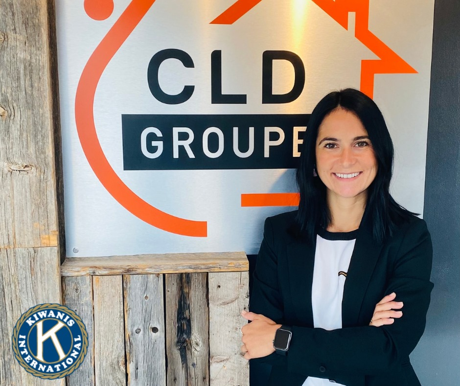
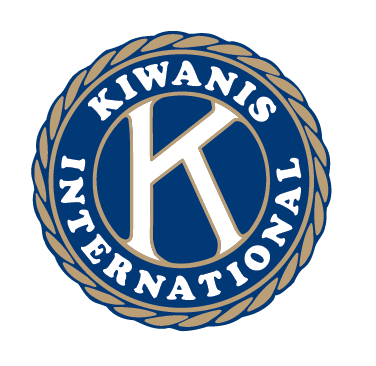

<!-- .slide: data-auto-animate -->

<!-- .element data-id="kiwanis" -->
---

<!-- .slide: data-background="asset/clubs-map-2.jpg" data-background-opacity="0.5" data-transition="zoom" data-background-transition="zoom" -->

<!-- .element data-id="kiwanis" -->

## A travers plus de 7000 clubs
<!-- .element data-id="title" -->
---

<!-- .slide: data-background="asset/clubs-map-2.jpg" data-background-opacity="0.5" data-auto-animate  -->

<!-- .element data-id="kiwanis" -->

## ...Et 200 000 membres
<!-- .element data-id="title" -->
---

<!-- .slide: data-auto-animate -->

<!-- .element data-id="kiwanis"  -->

## C'est aider...
## Un enfant à la fois

### Des impacts directs {.fragment .fade-up}
<!-- .element data-id="title" -->

---

<!-- .slide: data-auto-animate style=position:absolute-->
:::{style=top:-10px;left:10px;text-align:left;position:relative;float:left;z-index:99 #title}

<!-- .element data-id="kiwanis" -->
### Des impacts directs
#### Chalet du Kéno-Patro {.fragment .fade-in-then-semi-out data-fragment-index=1}
#### Chalet Bellevue {.fragment .fade-in-then-semi-out data-fragment-index=2}
#### Sentier d'Hébertisme au Kéno-Patro {.fragment .fade-in-then-semi-out data-fragment-index=3}
#### Fondation pour l'enfance et la jeunesse {.fragment .fade-in-then-semi-out data-fragment-index=4}
#### Support au travail de rue {.fragment .fade-in-then-semi-out data-fragment-index=5}
#### Sonde foetale {.fragment .fade-in-then-semi-out data-fragment-index=6}
#### Et plus... {.fragment .fade-in-then-semi-out data-fragment-index=7}
####  {.fragment}
:::

:::{style=position:absolute;top:10px;left:10px;width:100%}
{width=100% .fragment .fade-in-then-out data-fragment-index=1}
{width=100%  .fragment .fade-in-then-out data-fragment-index=2}
{width=100%  .fragment .fade-in-then-out data-fragment-index=3}
{width=100%  .fragment .fade-in-then-out data-fragment-index=4}
{width=100%  .fragment .fade-in-then-out data-fragment-index=5}
{width=100%  .fragment .fade-in-then-out data-fragment-index=6}
{.r-stack}
:::{.r-stack}

---

<!-- .slide: data-auto-animate -->

<!-- .element data-id="kiwanis"  -->

## C'est aider...
## Une communautée à la fois

### Par des acteurs locaux { .fragment .fade-up }
<!-- .element data-id="title" -->

---

<!-- .slide: data-auto-animate style=position:absolute-->
:::{style=top:-10px;left:10px;text-align:left;position:relative;z-index:99 #title}

<!-- .element data-id="kiwanis" -->
### Par des acteurs locaux
:::

:::{style=top:-10px;left:10px;text-align:left;position:relative;z-index:99 #title}
{width=30% style=border-radius:50px;border-width:10px;border-color:black;border-style:solid;display:block;float:left;left:100px;top:50px;position:relative .fragment .fade-in-then-semi-out}
{width=30% style=border-radius:50px;border-width:10px;border-color:black;border-style:solid;display:block;float:left;left:50px;top:0px;position:relative .fragment .fade-in-then-semi-out}
{width=30% style=border-radius:50px;border-width:10px;border-color:black;border-style:solid;display:block;float:left;left:20px;top:120px;position:relative .fragment .fade-in-then-semi-out}
{width=30% style=border-radius:50px;border-width:10px;border-color:black;border-style:solid;display:block;float:left;left:-650px;top:-300px;position:relative .fragment .fade-in-then-semi-out}
{width=30% style=border-radius:50px;border-width:10px;border-color:black;border-style:solid;display:block;float:left;left:50px;top:-350px;position:relative .fragment .fade-in-then-semi-out}
{width=30% style=border-radius:50px;border-width:10px;border-color:black;border-style:solid;display:block;float:left;left:300px;top:-700px;position:relative .fragment .fade-in-then-semi-out}
{width=30% style=border-radius:50px;border-width:10px;border-color:black;border-style:solid;display:block;float:left;left:-50px;top:-300px;position:relative .fragment .fade-in-then-semi-out}
{width=30% style=border-radius:50px;border-width:10px;border-color:black;border-style:solid;display:block;float:left;left:300px;top:-500px;position:relative .fragment .fade-in-then-semi-out}
{width=30% style=border-radius:50px;border-width:10px;border-color:black;border-style:solid;display:block;float:left;left:-100px;top:-900px;position:relative .fragment .fade-in-then-semi-out}
:::
---

<!-- .slide: data-auto-animate -->

<!-- .element data-id="kiwanis"  -->

## C'est aider...
## En ammassant des fonds

### Une levée de fond par année { .fragment .fade-up }
<!-- .element data-id="title" -->

---

<!-- .slide: data-auto-animate style=position:absolute-->
:::{style=top:-50px;left:10px;text-align:left;position:relative;z-index:99 #title}

<!-- .element data-id="kiwanis" -->
### Une levée de fond par année
:::

:::{style=top:-60px;left:10px;text-align:left;position:relative}

:::

---

<!-- .slide: data-auto-animate -->

<!-- .element data-id="kiwanis"  -->
   
## C'est une communauté... <!-- .element data-id="title" -->

---

<!-- .slide: data-background="asset/sag-lac.png" data-auto-animate data-background-transition="zoom" data-transition="zoom" -->

<!-- .element data-id="kiwanis"  -->

## C'est une communauté...
### De 7 Clubs au Saguenay-Lac-St-Jean

---

<!-- .slide: data-auto-animate style=position:absolute data-background="asset/sag-lac.png" data-auto-animate data-background-transition="zoom" data-transition="zoom" data-background-opacity="0.5" -->
:::{style=top:-50px;left:10px;text-align:left;position:relative;z-index:99 #title}

<!-- .element data-id="kiwanis" -->
### Saguenay-Lac-St-Jean
:::

Jonquière {.fragment .fade-up} 

Chicoutimi {.fragment .fade-up} 

La Baie {.fragment .fade-up} 

Alma {.fragment .fade-up} 

Lac-St-Jean Est {.fragment .fade-up} 

Chibougamau {.fragment .fade-up}

---

<!-- .slide: data-auto-animate -->

    

    

    

---

<!-- .slide: data-auto-animate -->

    

    

    

---

<!-- .slide: data-auto-animate -->

    

    

    

---

<!-- .slide: data-transition="fade" -->

